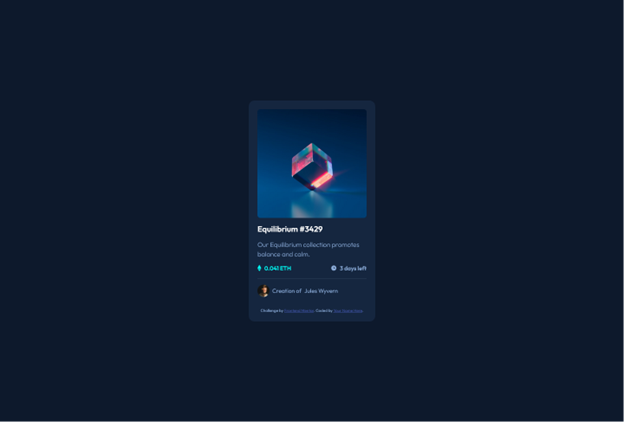
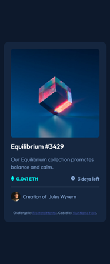

# Frontend Mentor - NFT preview card component solution

This is a solution to the [NFT preview card component challenge on Frontend Mentor](https://www.frontendmentor.io/challenges/nft-preview-card-component-SbdUL_w0U). Frontend Mentor challenges help you improve your coding skills by building realistic projects. 

## Table of contents

- [Overview](#overview)
  - [The challenge](#the-challenge)
  - [Screenshot](#screenshot)
  - [Links](#links)
- [My process](#my-process)
  - [Built with](#built-with)
  - [What I learned](#what-i-learned)
  - [Continued development](#continued-development)
  - [Useful resources](#useful-resources)
- [Author](#author)
- [Acknowledgments](#acknowledgments)

## Overview

### The challenge

Users should be able to:

- View the optimal layout depending on their device's screen size
- See hover states for interactive elements

### Screenshot

### Links

- Solution URL: [https://github.com/toshirokubota/nft-preview-card-component](https://github.com/toshirokubota/nft-preview-card-component)
- Live Site URL: [https://toshirokubota.github.io/nft-preview-card-component/](https://toshirokubota.github.io/nft-preview-card-component/)

## My process

### Built with

- Semantic HTML5 markup
- CSS custom properties
- Flexbox

### What I learned

In this project, I tried to use BEM naming.

### Continued development

I am in the "advanced CSS techniques" learning path. I will continue working on the path.

### Useful resources

- [BEM page](https://getbem.com) - This sites gives a quick introduction to the methodology.
- [BEM naming](https://getbem.com/naming/) - This page gives a concise description of BEM naming and dos and donts.

## Author

- Frontend Mentor - [@toshirokubota](https://www.frontendmentor.io/profile/toshirokubota)

## Acknowledgments

